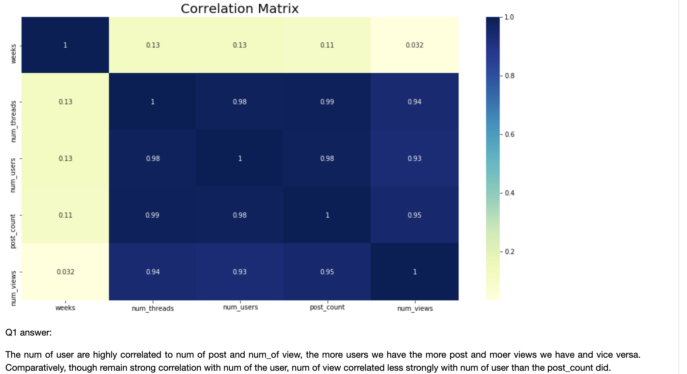
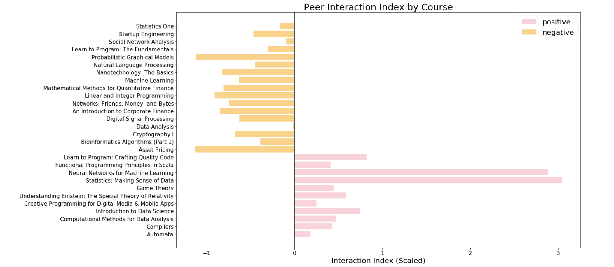
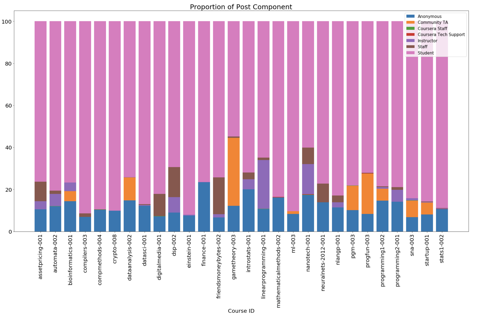
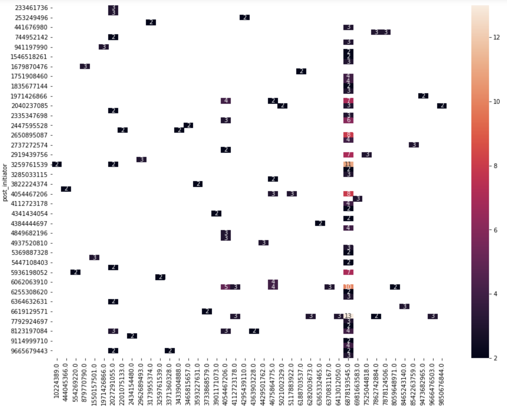
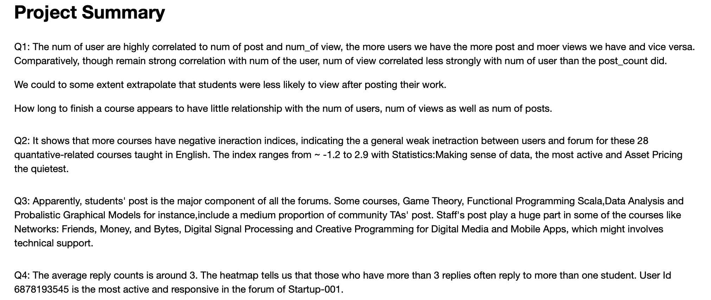

# Cousera-Post-Analysis

This project uses data from discussion threads from of 28 Coursera MOOCs, as well as, focuses on the user interaction revealed by their online activities of forum posts and replies. All of these 28 Coursera MOOCs focus on quantitative knowledge and programing skills including data analytics, machine learning, finance, statistics, etc. This project aims to use exploratory data analysis and data visualization to answer the questions in the following:

What is the relation between the number of course users, number of forum posts, and views of forum posts?

Using frequency counts and time lapse for post replies as index for user interaction, which course has the highest/lowest user interaction?

What is the ratio of forum posts by different types of participants across 28 courses? What is the general pattern of post replies? Does a forum post elicit many replies mostly from a few users (concentrated) or fewer replies but from several users (spread out)?

What is the general pattern of post replies to the same original forum post initiator(i.e. how and how many replies are given to a perosn who asks a question)?

